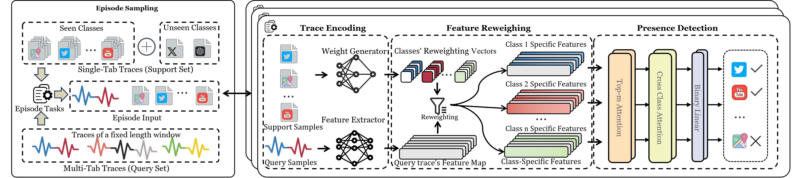

# MMF: Towards Practical Few-shot Multi-tab Website Fingerprinting

> **Paper:** *Towards Practical Few-shot Multi-tab Website Fingerprinting* (Anonymous submission)
> 
> **Abstract:** Website fingerprinting (WF) attacks can infer the visited websites to deanonymize Tor networks by analyzing encrypted traffic patterns. Recent few-shot WF methods reduce reliance on large-scale data collection, yet they predominantly formulate WF as a single-label classification task and rely on meta-learning episodes that assume disjoint label sets and globally stable embedding spaces. These assumptions break in the realistic multi-tab browsing, where traffic from multiple websites interleaves within a single observation window and the number of concurrent tabs is unknown. Meanwhile, the potential label space grows exponentially as the monitored set expands, rendering existing multi-tab WF methods prohibitively costly to update.
To address these challenges, **we propose MMF, a novel framework for few-shot multi-tab WF. MMF shifts the meta-learning objective from single-label discrimination to support-guided presence detection**. In each episode, we pair a mixed multi-tab query trace with a small set of single-tab support traces for each monitored website, and generate class-specific features by feature reweighting to decide which websites are present. This detection-centric formulation yields well-defined few-shot tasks in multi-tab scenarios and enables MMF to detect previously unseen websites from limited traces.
We evaluate MMF on established public datasets and a new real-world dataset collected under varied browsing conditions. Results demonstrate that MMF consistently surpasses state-of-the-art multi-tab WF attacks across all experimental settings. Notably, in the 5-shot scenario, MMF achieves improvements of up to 300\% in Novel Precision@k, highlighting its strong capability for few-shot detection in dynamically growing website sets.

---

## Overview

| Property | MMF |
|----------|-----|
| Multi-tab browsing | ✅ |
| Few-shot adaptation | ✅ |
| Tab count unknown at inference | ✅ |
| Continual onboarding of new websites | ✅ |

**Highlights:**
- In 5-shot scenarios, MMF achieves up to **300% improvement** in Novel Precision@k over state-of-the-art baselines.
- A **single shared model** handles mixed-tab queries without per-tab retraining.
- The detection-centric formulation avoids combinatorial explosion of class combinations.

---

## Framework



MMF consists of three modules:

1. **Trace Encoding** — A DF-style 1D convolutional encoder maps each multi-tab query trace to a feature map that preserves local burst-level microstructure. The support branch encodes K single-tab traces and produces a class-conditioned reweighting vector *W_c*.

2. **Feature Reweighting** — *W_c* performs channel-wise gating on the query feature map (a dynamic 1×1 depthwise Conv1D), suppressing irrelevant channels and amplifying target-class evidence.

3. **Presence Detection** — Two layers of Top-m self-attention retain the most salient interactions; two layers of cross-class attention model co-occurrence correlations; an MLP produces independent per-class binary presence logits.

```
Support traces (K×single-tab)  →  Weight Generator  →  W_c  ─┐
                                                               ↓
Multi-tab query trace           →  Feature Extractor →  F_j  →  Feature Reweighting →  F_{j,c}  →  Presence Head  →  p_{j,c}
```

**Training objective:** Weighted Binary Cross-Entropy (WBCE) to handle extreme class imbalance.

---

## Repository Structure

```
MMF_merged/
├── train_enhanced.py          # Stage 1: Base meta-training
├── finetune.py                # Stage 2: Few-shot fine-tuning
├── evaluate_base.py           # Evaluate base model + visualize reweighting coefficients
├── test_finetune.py           # Evaluate fine-tuned model on novel classes
├── generate_multitab_datasets.py  # Synthesize multi-tab traces from single-tab data
├── run_experiments.py         # Batch experiment runner
│
├── models/
│   ├── feature_extractors.py  # EnhancedMultiMetaFingerNet (main model)
│   ├── classification_head_enhanced.py  # Top-m + Cross-class attention heads
│   └── dynamic_conv1d.py      # Feature reweighting (dynamic 1×1 Conv1D)
│
├── data/
│   ├── meta_traffic_dataset.py    # Query/Support dataset for base training
│   ├── meta_traffic_dataloader.py # DataLoader wrapper
│   ├── multi_tab_generator.py     # Multi-tab trace synthesis core
│   ├── fewshot_dataset_generator.py  # Few-shot dataset generator (default, supports OW)

│
├── utils/
│   ├── metrics.py             # Evaluation metrics (mAP, ROC-AUC, P@k, R@k, Novel metrics)
│   ├── loss_functions.py      # WeightedBCE, FocalLoss, ASL
│   ├── model_manager.py       # Checkpoint save/load
│   └── misc.py                # Distributed training utilities
│
└── configs/
    ├── base_train/
    │   └── example_3tab.json  # Example base training config (3-tab)
    └── fewshot/
        └── example_20shot_3tab.json  # Example fine-tuning config (20-shot, 3-tab)
```

---

## Installation

```bash
git clone <repo_url>
cd MMF_merged
pip install torch torchvision torchaudio  # PyTorch >= 1.12
pip install numpy scikit-learn tqdm tensorboard
```

**Requirements:** Python 3.9+, PyTorch with CUDA, scikit-learn.

---

## Quick Start

### Step 0: Prepare Single-tab Data

MMF uses the public CW/OW dataset from [Deep Fingerprinting (DF)](https://dl.acm.org/doi/pdf/10.1145/3243734.3243768). Download the `.npz` files and preprocess with:

```bash
python data/process_npz_data.py --input /path/to/CW.npz --output /path/to/single_tab_data
```

Then isolate training data from valid data (support OW scenario):

```bash
python data/split_ow_folder.py --input /path/to/OW_data --output /path/to/OW_split
```

---

### Step 1: Synthesize Multi-tab Training Data

Generate multi-tab query traces and support sets for base training (3/4/5-tab):

```bash
python generate_multitab_datasets.py \
    --input /path/to/single_tab_data \
    --output /path/to/base_training_data \
    --tabs 3 4 5 \
    --num_classes 60
```
Note: we can set `--mixed_tabs` to merge the mixed-tabs dataset.

This creates `train/` and `test/` splits with `query_data/`, `support_data/`, and index JSON files under each tab-count directory.

---

### Step 2: Base Training

Edit `configs/base_train/example_mixed_tab.json` to set your data paths and GPU configuration, then run:

```bash
# Single tab count
python train_enhanced.py --config configs/base_train/example_3tab.json

# Batch training (3, 4, and 5 tabs sequentially), we need to set the config files in the configs folder, as shown as the examples in the folder.
python run_experiments.py --stage base --tabs 3 4 5
```

Key hyperparameters (Table 9 in the paper):

| Parameter | Value |
|-----------|-------|
| Query length *L_q* | 20000 |
| Support length *L_s* | 10000 |
| Shots per class *K* | 5 |
| DF blocks | 4 |
| Top-m attn layers *L* | 2 |
| Cross-class attn layers *L×* | 2 |
| Loss | Weighted BCE |
| Dropout | 0.15 |
| Optimizer | Adam (lr=5e-5, wd=1e-4) |

---

### Step 3: Synthesize Few-shot Data

Generate the few-shot dataset for onboarding novel websites (classes 60–89):

```bash
python data/fewshot_dataset_generator.py \
    --novel-source-dir /path/to/single_tab_data \
    --base-training-dir /path/to/base_training_data \
    --output-dir /path/to/fewshot_data \
    --base-classes 0-59 \
    --novel-classes 60-89 \
    --k-shot 20 \
    --num-base-per-query 2
```

Add `--ow` to include unmonitored (class 95) traffic for open-world few-shot evaluation.

---

### Step 4: Few-shot Fine-tuning

Edit `configs/fewshot/example_20shot_3tab.json` to set your data paths and the `checkpoint_path` from Step 2:

```bash
# Single experiment
python finetune.py --config configs/fewshot/example_20shot_3tab.json
```

---

### Step 5: Evaluation

**Evaluate base model** (mAP, ROC-AUC, reweighting coefficient visualization):

```bash
python evaluate_base.py --config configs/base_train/example_mixed_tab.json
```

**Evaluate few-shot model** (Overall mAP/AUC + Novel P@k / R@k):

```bash
python test_finetune.py --config configs/fewshot/example_20shot_3tab.json
```
---

## Datasets

MMF is evaluated on two data sources:

**Synthetic (public) dataset** — Built on the DF CW/OW dataset by time-consistent mixing of single-tab traces. The synthesis algorithm (Algorithm 1 in the paper) allows partial overlap and full containment between tabs, better reflecting real browsing.

| Dataset | #Classes | Setting |
|---------|----------|---------|
| CW (DF) | 60 base + 30 novel | Closed-world |
| OW (DF) | 60 base + 30 novel + unmonitored | Open-world |
| WTF-PAD | 60 base + 30 novel | Defense-aware |
| Walkie-Talkie | 60 base + 30 novel | Defense-aware |

**Self-collected real-world dataset** — 50 popular websites × {3,4,5}-tab combinations collected over ~2 months from Singapore servers. 25 additional websites with limited traces are used as novel classes for few-shot evaluation. Collection follows the ARES pipeline with Docker-isolated Tor Browser sessions.

---


## Related Work

The table below summarizes the key assumptions of representative multi-tab WF methods compared in our evaluation:

| Method | Multi-Tab | Few-Shot | Tabs Unknown |
|--------|:---------:|:--------:|:------------:|
| DF (CCS 2018) | ✗ | ✗ | ✗ |
| BAPM (ACSAC 2021) | ✅ | ✗ | ✗ |
| TMWF (CCS 2023) | ✅ | ✗ | ✗ |
| ARES (arXiv 2025) | ✅ | ✗ | ✅ |
| FMWF (TheWebConf 2025) | ✅ | ✅ | ✗ |
| **MMF (ours)** | ✅ | ✅ | ✅ |

- **[BAPM (ACSAC 2021)](https://dl.acm.org/doi/10.1145/3485832.3485891)** — Block Attention Profiling Model; one of the earliest deep-learning approaches for multi-tab WF, treating each tab's feature block independently.
- **[FMWF (TheWebConf 2025)](https://dl.acm.org/doi/10.1145/3696410.3714561)** — "Beyond Single Tabs", a Transformer-based few-shot multi-tab WF method; assumes a fixed known tab count at both training and test time.
- **[TMWF (CCS 2023)](https://github.com/jzx-bupt/TMWF)** — Transformer-based multi-tab WF; our multi-tab synthesis pipeline extends TMWF's time-consistent mixer to allow full trace containment.
- **[ARES (arXiv 2025)](https://github.com/Xinhao-Deng/Multitab-WF-Datasets)** — Robust multi-tab WF with unknown tab count; we build on their data collection pipeline for real-world trace acquisition.
- **[WFlib (CCS 2024)](https://github.com/Xinhao-Deng/Website-Fingerprinting-Library)** — A unified benchmark library for DL-based WF attacks (DF, ARES, TMWF, etc.), useful for reproducing baselines.

---

## Citation

If you use MMF in your research, please cite:

```bibtex
@article{mmf2025,
  title   = {Towards Practical Few-shot Multi-tab Website Fingerprinting},
  author  = {Anonymous Author(s)},
  year    = {2025}
}
```

---

## License

This repository is released for research purposes only. Please review the ethical considerations in the paper before use.
